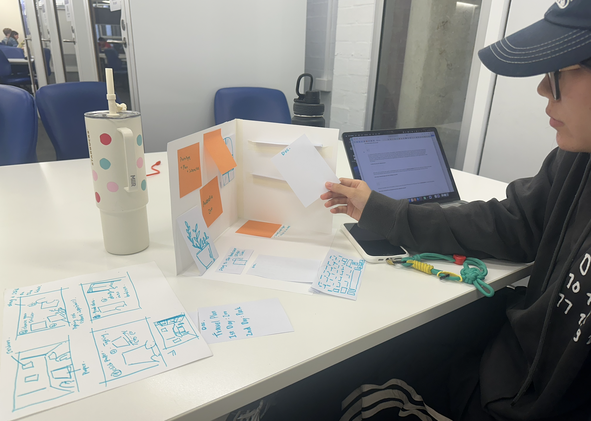
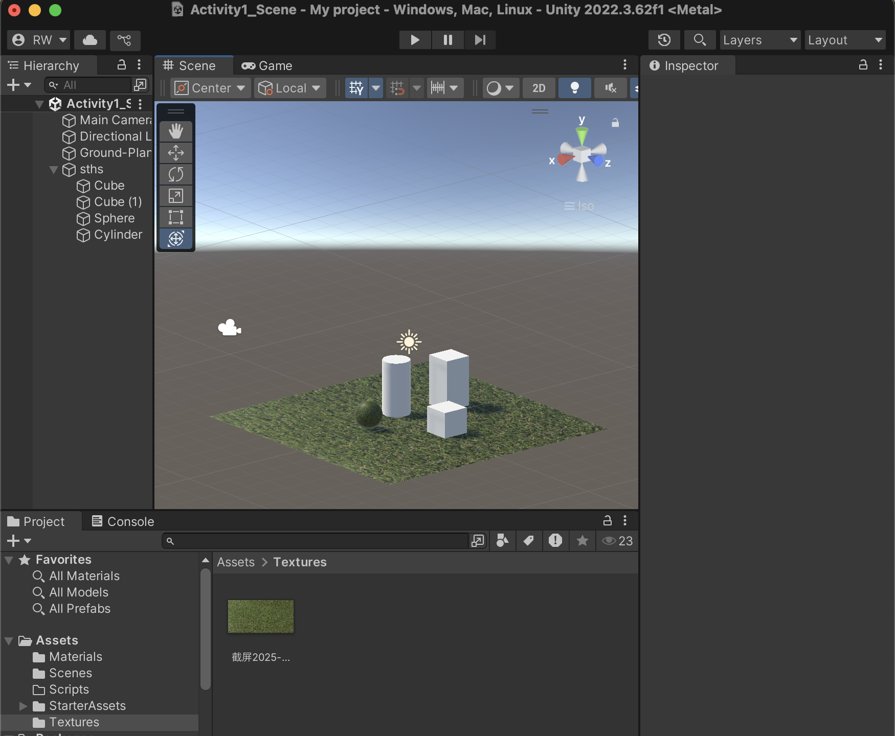
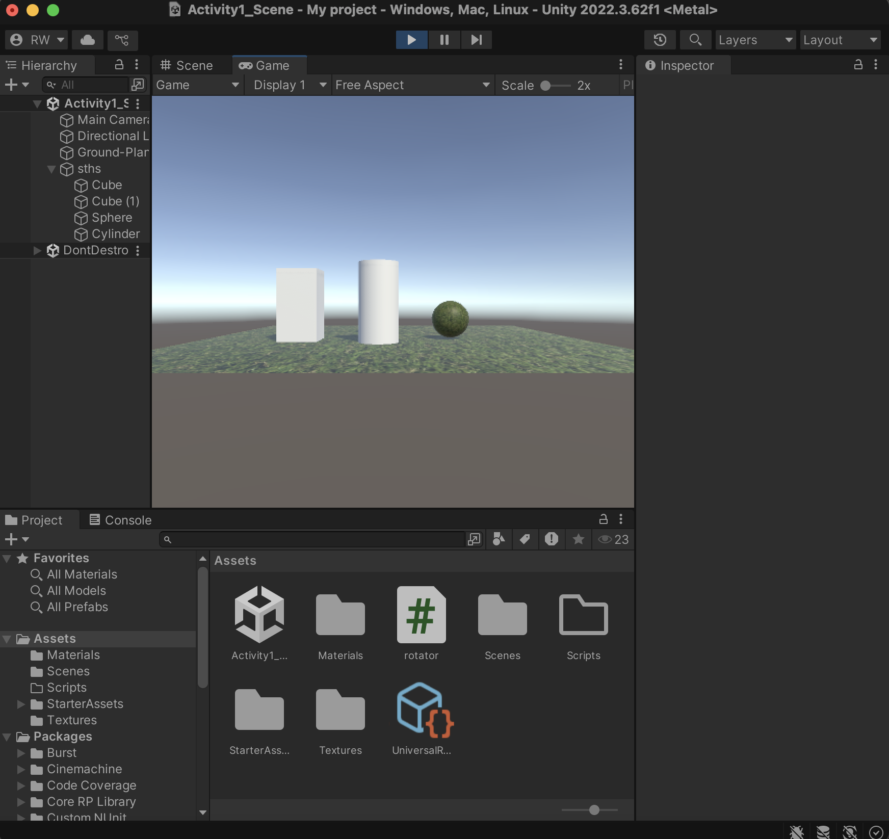

# Ruihan-Wu_DECO7230_2025

##Week2-Introduction & Setup##1st_Aug_2025##

✨What I learned this week✨
During this week’s learning, I practiced basic code structure in Unity and followed the class tutorial to understand some common syntax and basic interaction logic. This activity helped me understand better how to connect scripts with scene in Unity and complete basic operation, which also gave me preparation for building future functions. Also, in the studio class, I completed the lo-fi prototype of my project and did a basic test. By observing and recording classmates’ feedback, I updated the original idea. More specifically, I improved the idea of copying Word’s basic function and re-organised the function priorities, which helped me understand the real focus and key interaction points of the project more clearly.

✨Low-fidelity test✨
I received some suggestions during prototype testing.
First, I can change the document archive system into auto-absorption. It means when users finish writing, the document will directly move and stick to the storage wall, to reduce the visual confusion from stacked papers.
Second, I can improve the interaction hints in space. For example, change simple words like “drag, type, and stick on wall” into more clear sentences such as “drag a sticker and type your inspiration then put it on the wall”.
Also, I got a suggestion to change the word “double click” into “double click get document paper” to show clearer instruction.

✨Reflection✨
During the test, I found that the user path in my idea still had some problems and confusion when people really tried it. This made me realise that lo-fi prototype testing is helpful and fast to find problems. At the same time, trying to understand the script also helped me feel less unfamiliar with Unity. I hope in the next few weeks I can turn the design concept into something that users can really interact with.

✨Next steps✨
In the coming learning, I will keep building the Unity interface and interaction, and try to build some of the prototype scenes from the lo-fi test. Based on that, I will try to improve the visual design and interaction logic part of the project.

**Screenshot of my progress:

Here is the pictures of my lo-fi prototype test:

Here is the unity practice progress:

