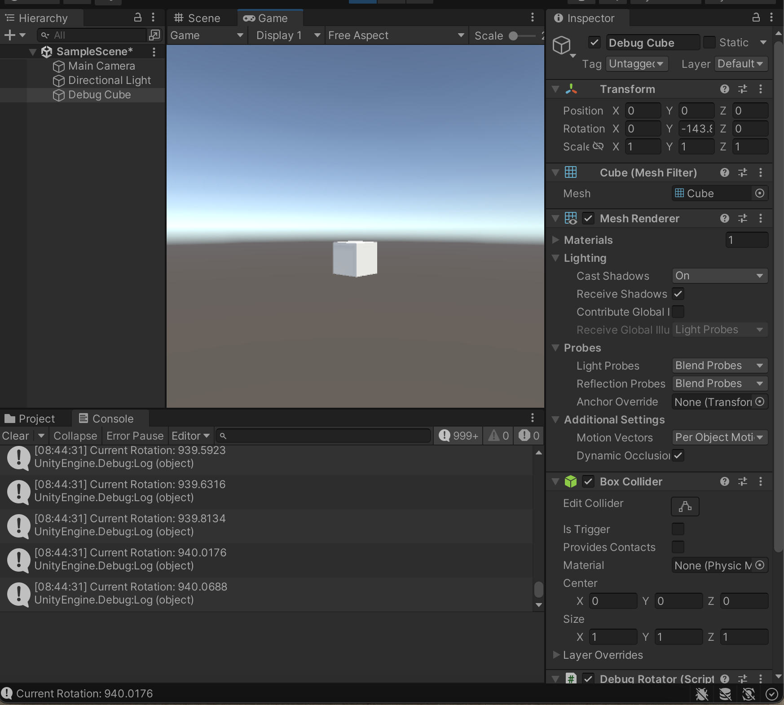

# Ruihan-Wu_DECO7230_2025

##Week3-Project Settings##15th_Aug_2025##

✨What I learned this week✨
This week I basically completed the build settings in Unity for my XR project. During the process, I met some confusion about the settings and using Mac, such as I could not find the Target Architectures option. So I asked my tutor for help.
After that, in the studio class, I followed the class content to finish the GitHub setup. Then I focused on planning further user testing for my low-fidelity prototype. I prepared to mainly observe: whether the user can understand the interaction of the sticky notes, whether the process of archiving documents is clear, and whether the whole space layout supports an immersive creative atmosphere. I also planned to use the Think Aloud method to collect user feedback and observe their natural operation and understanding process.

✨Reflection✨
Through trying the Unity setup process, I started to have a basic understanding of how to build the project and adapt it for XR devices. Even though there were still some problems I could not solve by myself, the process helped me understand Unity more deeply. At the same time, during the process of designing the low-fidelity testing plan, I realised I could not ignore the possible confusion users may have. Based on the first user’s experience, I started to think more from the user’s view, trying to reduce unnecessary steps and make the whole experience smoother and more intuitive.

✨Next steps✨
In the coming learning, I will try to start building the Unity interface and interaction, and try to build some of the prototype scenes that can be used. Based on that, I will try to improve the  whole interaction logic part of the project.

**Screenshot of my progress:

Here is the unity practice progress:

